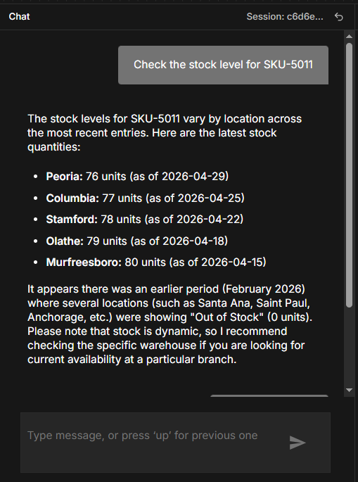
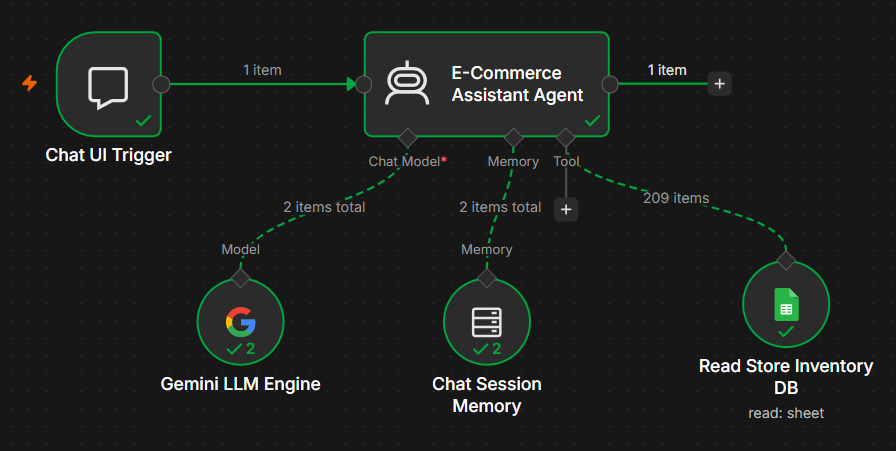
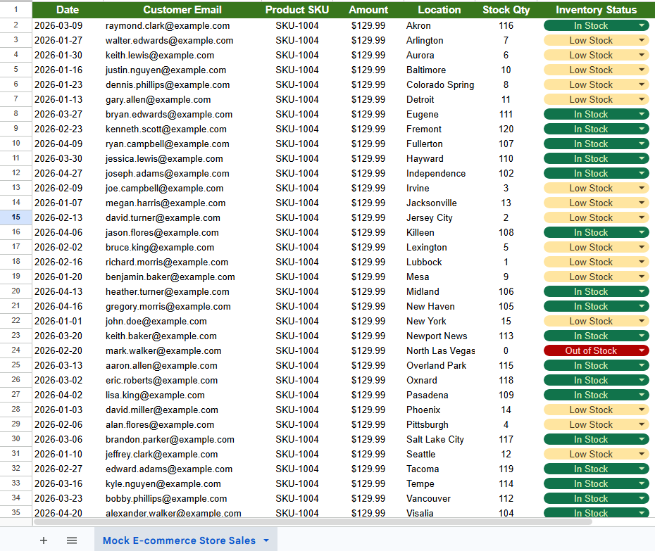

# AI-Powered E-Commerce Data Analyst 📊🤖

An autonomous, production-grade backend orchestration pipeline that converts a static spreadsheet database into an interactive AI Data Analyst. This agent dynamically evaluates chat inquiries, queries live transaction logs, interprets inventory states, and retains contextual dialogue parameters over multi-turn conversations.

---

## 🖥️ System Architecture & Interface

### 1. The Chat Interface (Live Demo Output)
Below is the live execution environment showing the agent processing data lookups seamlessly:

### 2. The Orchestration Engine (n8n Workflow Pipeline)
Built utilizing advanced tool-calling routing schemas where the agent autonomously interacts with active resources:

### 3. The Unified Live Ledger (Google Sheets Database)
A unified transaction registry tracking historical amounts, active warehouse availability indexes, and execution criteria flags:

https://docs.google.com/spreadsheets/d/1-7lAX3G5VjJ-0EKu8tHt0Ig4tcXDDtPaZziFlAfmKFQ/edit?usp=sharing
---

## 🛠️ Technology Stack & Dependencies
- **Pipeline Orchestration Engine:** n8n (Advanced AI Agent Core)
- **Cognitive Model Core:** Google Gemini LLM Engine
- **Relational Storage Component:** Google Sheets Core API 
- **Session Layer:** Contextual Simple Token Memory Block

## ⚙️ Core Operational Capabilities
- **Semantic Field Translation:** Dynamically translates colloquial user expressions (e.g., mapping requests for "product price" directly to the database column tracking transactional `Amount`).
- **Data Integration Matrix:** Merges sales history parameters along with dynamic `Stock Qty` and `Inventory Status` thresholds within a single structural schema layout.
- **Conversational Memory Retention:** Maintains data pointers over persistent conversation blocks, allowing full relational processing for context-dependent multi-turn inquiries.

## 🚀 Deployment & Installation Instructions
1. Initialize an active instance of **n8n** (Cloud Hosted or via Local Container).
2. Create an empty workflow canvas, navigate to the context configuration settings panel in the top-right corner, and select **Import from File**.
3. Load the `ecommerce-ai-analyst.json` file included within this project repository.
4. Establish security authorization profiles for both your **Google Sheets API node connection** and your active **Google Gemini Account Token credentials**.
5. Toggle the configuration environment switch to **Active** and begin processing queries.
